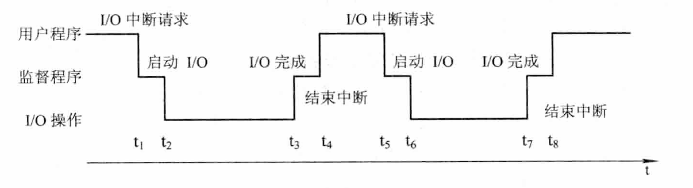
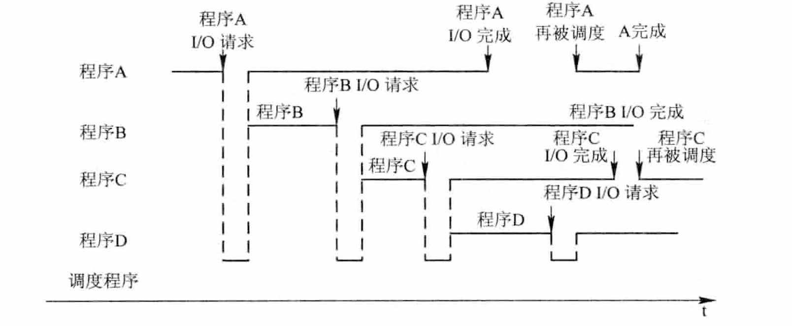

# 操作系统的目标与作用

1. **操作系统的目标：**
	方便性
	有效性
	可扩充性
	开放性
2. **操作系统的作用：**
	OS 作为用户与计算机硬件系统之间的接口
	OS 作为计算机系统资源的管理者
	OS 实现了对计算机资源的抽象
3. **推动操作系统发展的主要动力：**
	不断提高的计算机资源利用率
	方便用户
	期间的不断更新迭代
	计算机结构的不断发展
	不断提出新的应用需求
# 操作系统的发展过程
## 未配置操作系统的计算机系统

1. **人工操作系统：**
	用户独占全机
	CPU 等待人工操作
2. **脱机输入/输出（Off-line I/O）方式：**
	CPU 输出时，先由 CPU 把数据直接从内存高速地送到磁带上，然后在另一台**外围机**控制下，再将磁带上的结果通过相应的输出设备输出
	减少了 CPU 的空闲时间
	提高了 I/O 速度

## 单道批处理系统

系统对作业的处理是成批进行的，但在内存中只保持一道作业，故称单道批处理系统
**处理过程：**

**缺点**：
	系统中的资源得不到充分的利用
	内存中仅有一道程序，每逢该程序在运行中发出 I/O 请求后，CPU 便处于等待状态

## 多道批处理系统

在该系统中，用户所提交的作业先存放在外存中，并排成一个队列，成为“后备队列”。然后由作业先存放调度程序按照一定的算法，从后备队列中选若干个作业调入内存，使他们共享 CPU 和系统的各种资源

**优缺点：**
	资源利用率高
	系统吞吐量大
	平均周转时间长
	无交互能力
**需要解决的问题**：
	处理机争用问题
	内存分配和保护问题
	I/O 设备分配问题
	文件的组织和管理问题
	作业管理问题
	用户与系统的接口问题

## 分时系统

**引入：**
	在一台主机上连接了多个配有显示器和键盘的终端并由此所组成的系统，该系统允许多个用户同时通过自己的终端，以交互方式使用计算机，共享主机资源。
	满足了用户需求：（1）人机交互；(2)  共享主机
**解决的关键问题：**
	及时接受
	及时处理：（1）作业直接进入内存；（2）采用轮转运行方式
**特诊:**
	多路性
	独立性
	及时性
	交互性
## 实时系统

**引入：**
	实时系统最主要的特征是将时间作为关键参数，它必须对所接受到的某些信号做出“及时”或“实时”的反应。它是指新系统能及时响应外部事件的请求，在规定的时间内完成对使劲按的处理，并控制所有实时任务协调一致地运行。
**实时任务的类型:**
	周期性实时任务和非周期性实时任务
	硬实时任务和软实时任务
**实时系统和分时系统的比较**
（从多路性、独立性、及时性、交互性、可靠性来比较，表格）

## 微机操作系统

1. **单用户单任务操作系统**
	CP/M
	MS-DOS
2. **单用户多任务操作系统**
	只允许一个用户上机，但运行用户把程序分成若干个任务，让它们并发执行，从而有效改善性能
3. **多用户多任务操作系统**
	运行多个用户通过各自的终端，使用同一台机器，共享主机系统的各自资源，每个用户程序又可以进一步分成几个任务，并发执行，提高吞吐量和资源利用率

# 基本特征
## 并发（Concurrence）

概念区分：
并行性：两个或多个事件在同一时刻发生
并发性：
