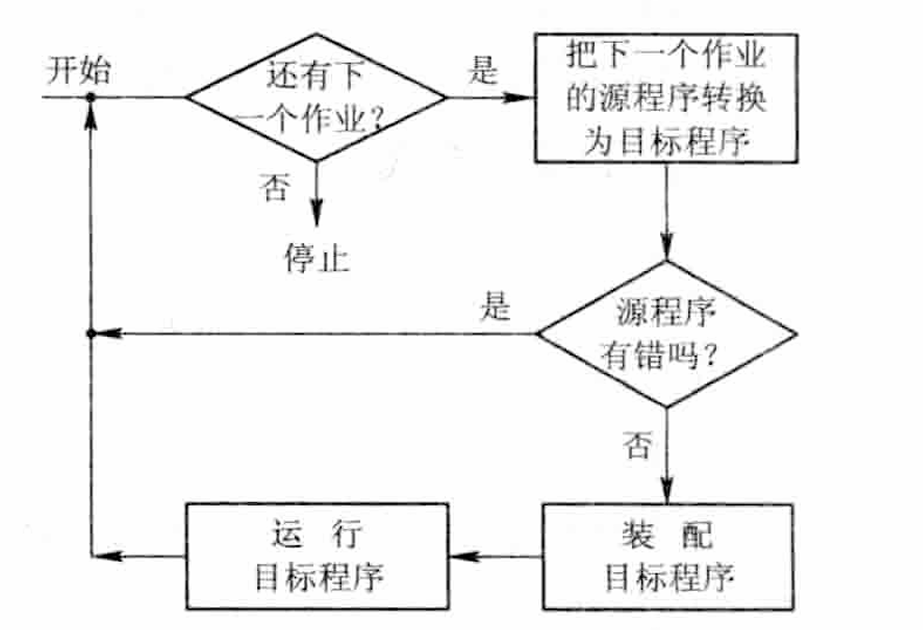

# 操作系统的目标与作用

1. **操作系统的目标：**
>  方便性
>  有效性
>  可扩充性
>  开放性

2. **操作系统的作用：**
>  OS 作为用户与计算机硬件系统之间的接口
>  OS 作为计算机系统资源的管理者
>  OS 实现了对计算机资源的抽象

3. **推动操作系统发展的主要动力：**
> 不断提高的计算机资源利用率
> 方便用户
> 期间的不断更新迭代
 >计算机结构的不断发展
> 不断提出新的应用需求

---
# 操作系统的发展过程
## 未配置操作系统的计算机系统

1. **人工操作系统：**
> 用户独占全机
> CPU 等待人工操作

2. **脱机输入/输出（Off-line I/O）方式：**
> CPU 输出时，先由 CPU 把数据直接从内存高速地送到磁带上，然后在另一台**外围机**控制下，再将磁带上的结果通过相应的输出设备输出
> 减少了 CPU 的空闲时间
> 提高了 I/O 速度

## 单道批处理系统

系统对作业的处理是成批进行的，但在内存中只保持一道作业，故称单道批处理系统
1. **处理过程：**

2. **缺点**：
> 系统中的资源得不到充分的利用
> 内存中仅有一道程序，每逢该程序在运行中发出 I/O 请求后，CPU 便处于等待状态

## 多道批处理系统

在该系统中，用户所提交的作业先存放在外存中，并排成一个队列，成为“后备队列”。然后由作业先存放调度程序按照一定的算法，从后备队列中选若干个作业调入内存，使他们共享 CPU 和系统的各种资源

1. **优缺点：**
> 资源利用率高
> 系统吞吐量大
> 平均周转时间长
> 无交互能力

2. **需要解决的问题**：
> 处理机争用问题
> 内存分配和保护问题
> I/O 设备分配问题
> 文件的组织和管理问题
> 作业管理问题
> 用户与系统的接口问

## 分时系统

1. **引入：**
> 在一台主机上连接了多个配有显示器和键盘的终端并由此所组成的系统，该系统允许多个用户同时通过自己的终端，以交互方式使用计算机，共享主机资源。
> 满足了用户需求：（1）人机交互；(2)  共享主机

2. **解决的关键问题：**
> 及时接受
> 及时处理：（1）作业直接进入内存；（2）采用轮转运行方式

3. **特诊:**
> 多路性
> 独立性
> 及时性
> 交互性
## 实时系统

1. **引入：**
> 实时系统最主要的特征是将时间作为关键参数，它必须对所接受到的某些信号做出“及时”或“实时”的反应。它是指新系统能及时响应外部事件的请求，在规定的时间内完成对使劲按的处理，并控制所有实时任务协调一致地运行。

2. **实时任务的类型:**
> 周期性实时任务和非周期性实时任务
> 硬实时任务和软实时任务

3. **实时系统和分时系统的比较**

| 比较维度 | 分时系统              | 实时系统              |
| ---- | ----------------- | ----------------- |
| 多路性  | 多用户通过终端同时使用一台主机   | 多路采集或控制           |
| 独立性  | 每个用户感觉独占主机        | 每个终端独立工作          |
| 及时性  | 响应时间在秒级           | 响应时间在毫秒级甚至微秒级     |
| 交互性  | 强交互性，用户可以直接干预程序运行 | 交互性较弱，主要用于控制和信息采集 |
| 可靠性  | 要求一般              | 要求高可靠性            |

## 微机操作系统

1. **单用户单任务操作系统**
> CP/M
> MS-DOS

2. **单用户多任务操作系统**
> 只允许一个用户上机，但运行用户把程序分成若干个任务，让它们并发执行，从而有效改善性能

3. **多用户多任务操作系统**
> 运行多个用户通过各自的终端，使用同一台机器，共享主机系统的各自资源，每个用户程序又可以进一步分成几个任务，并发执行，提高吞吐量和资源利用率

---
# 基本特征
## 并发（Concurrence）

1. **概念区分：**
> 并行性：两个或多个事件在**同一时刻**发生
> 并发性：两个或多个事件在**同一时间间隔内**发生

2. **进程：**
> 指在系统中能独立运行并作为资源分配的基本单位，它由一组机器指令、数据和堆栈等组成，是一个能独立运行的活动实体

3. **操作系统上的并发：**
> 指计算机系统中“同时”运行着多个程序，这些程序宏观上看是同时运行着的，而微观上看是交替运行的

## 共享（Sharing）

OS 环境下的资源共享或称之为资源复用，是指系统中的资源可供内存中多个并发执行的进程共同使用，目前是实现资源共享的方式有两种：
- **互斥共享方式：**
  系统中的某些资源，虽然可以提供给多个进程使用，但一个时间段内只允许一个进程访问该资源
- **同时访问方式：**
  系统中的某些资源，允许一个时间段内由多个进程“同时”对它们进行访问

**注：**
> 并发和共享是两个最基本的特征，两者互为存在条件
## 虚拟（Virtual）

在 OS 中，把通过某种技术将一个物理实体变成若干个逻辑上的对应物的功能称为“虚拟”，前者为实，后者为虚，OS 中利用两种技术来实现“虚拟”：
- **时分复用技术：**
  它利用某设备为一用户服务的**处理器**空闲时间，又转去其他用户服务
> （1）虚拟处理机技术
> （2）虚拟设备技术
- **空分复用技术：**
  利用**存储器**的空闲时间分区域存放和运行其它的多道程序
## 异步（Asynchronism）

在多道程序环境下，允许多个程序并发执行，但由于资源有限，进程的执行不是一贯到底的，
而是走走停停，以不可预知的速度向前推进，这就是进程的异步性。

**注：**
> 如果没有并发性，就谈不上虚拟和异步

---
# 操作系统的主要功能

引入 OS 的主要目的是，为多道程序运行提供良好的运行环境，以保证多道程序能有条不紊地、高效地运行，并能最大程度地提高系统中各种资源的利用率，方便用户使用。
## 处理机管理功能

处理机的分配和运行都是以**进程**为基本单位的，处理机管理的**主要功能**有：创建和撤销进程、对诸进程的运行进行协调，实现进程之间的信息交换，按照一定的算法把处理机分配给进程。

1. **进程控制：**
> 为作业的创建进程、撤消已结束的进程，以及控制进程在运行过程中的状态转换。
2. **进程同步：**
> 该机制主要任务是为多个进程（含线程）的运行进行协调。
> *常用的协调方式：（1）进程互斥方式：诸进程在对**临界资源**进行访问时的方式（**LOCK**）；（2）进程同步方式：在相互合作去完成共同任务的诸进程间，由同步机构对它们的执行次序加以协调（**信号量机制**）。*
3. **进程通信：**
> 实现合作进程之间的信息交换。
4. **调度：**
> 传统 OS 中，包括两步走：（1）**作业调度**：从后备队列中按照一定的算法选择出若干个作业，为它们分配运行所需要的资源，再将这些作业调入**内存**后，分别为它们建立进程，成为可能获得处理机的**就绪程序**，插入就绪队列；（2）**进程调度**：从就绪队列中按一定算法选出**一个**进程，将**处理机**分配给它，并为它设置运行现场，使它投入执行。
## 存储器管理功能

**主要任务：**
是为多道程序运行提供良好的环境，提高存储器的利用率，方便用户使用，并能从逻辑上扩充内存。

**功能：**
1. **内存分配：**
> 为每道程序分配内存空间、尽量减少不可用的内存空间（碎片）、允许正在允许的程序申请附加内存空间
> *方式：（1）静态分配方式（2）动态分配方式*
2. **内存保护：**
> 确保每道程序仅在自己的内存空间内允许，彼此不干扰；绝不允许用户访问操作系统的程序和数据，也不允许用户程序转移到非共享的其它用户程序去执行。
3. **地址映射：**
> 存储器管理必须能够将地址空间中的**逻辑地址**转换成内存空间中的与之对应的**物理地址**
4. **内存扩充：**
> 是通过虚拟存储技术，从逻辑上扩充内存容量，使用户所感受到的内存容量比实际容量大得多，以便更多的用户并发程序运行。
> *实现功能：（1）请求调入功能：运行时若发现继续运行时需要的程序和数据未装入内存，可向 OS 发出请求（2）置换功能：若内存不足，将暂时不用的程序和数据调入硬盘，腾空间*
## 设备管理功能

## 文件管理功能

## 操作系统与用户之间的接口

---
# OS 结构设计
