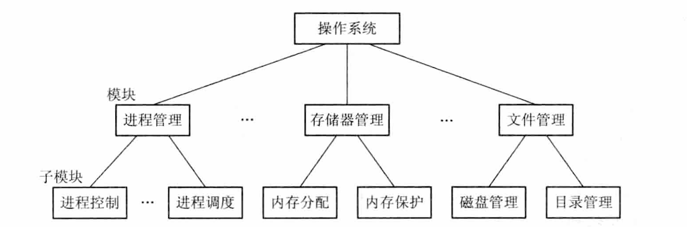
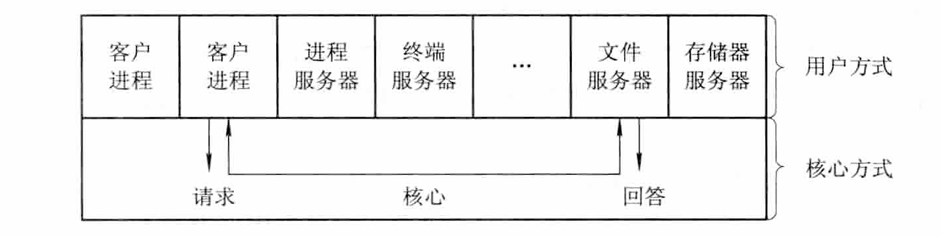
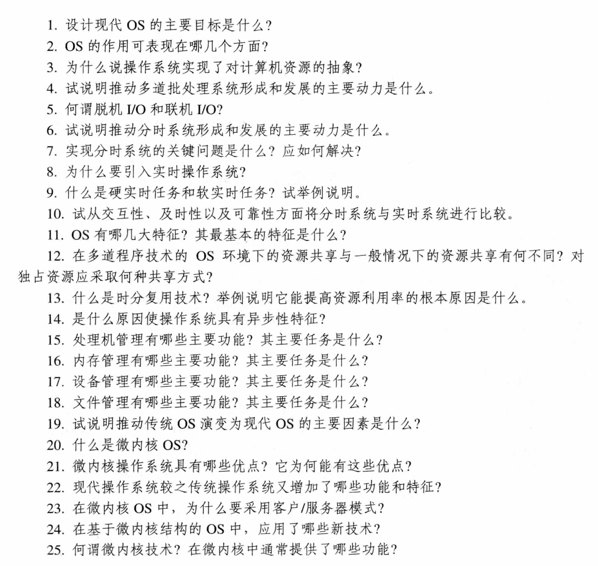

# 操作系统的目标与作用

## 1. 操作系统的目标

- **方便性**：使计算机更易于使用
- **有效性**：提高系统资源利用率和吞吐量
- **可扩充性**：便于增加新功能和模块
- **开放性**：遵循标准，便于兼容和移植

## 2. 操作系统的作用

- **作为用户与计算机硬件系统之间的接口**：提供命令接口、图形接口、程序接口等
- **作为计算机系统资源的管理者**：管理处理器、存储器、I/O设备、文件等资源
- **实现了对计算机资源的抽象**：将硬件细节隐藏，提供简单统一的接口

## 3. 推动操作系统发展的主要动力

- **不断提高计算机资源利用率**：追求更高的CPU、内存、I/O设备利用率
- **方便用户**：改善用户体验，降低使用门槛
- **硬件结构的不断发展**：计算机硬件升级推动OS演进
- **新的应用需求**：新应用场景（如实时处理、多媒体）驱动OS功能扩展
- **技术迭代**：软件工程、算法、设计模式的进步

---
# 操作系统的发展过程
## 未配置操作系统的计算机系统

### 1.1 人工操作系统

- **用户独占全机**：一次只为一个用户服务，用户直接操作计算机硬件
- **CPU 等待人工操作**：人工操作速度慢，导致 CPU 大量空闲

### 1.2 脱机输入/输出（Off-line I/O）方式

- **工作流程**：CPU 输出时，先把数据从内存高速送到磁带；然后在外围机控制下，将磁带数据通过输出设备输出
- **优点**：
	减少了 CPU 的空闲时间
	提高了 I/O 速度（外围机专门负责 I/O）
- **解释**：这种方式实现了输入/输出与主机计算的并行，是早期批处理系统的雏形

## 单道批处理系统

系统对作业的处理是成批进行的，但在内存中只保持一道作业，故称单道批处理系统。

### 2.1 处理过程

作业成批输入到磁带，由监控程序逐个调入内存执行，执行完毕后再调入下一个作业。

### 2.2 缺点

- **资源利用率低**：系统中的资源（如 CPU、I/O 设备）得不到充分利用
- **CPU 等待 I/O**：内存中仅有一道程序，当该程序发出 I/O 请求时，CPU 便处于等待状态

## 多道批处理系统

### 3.1 工作原理

用户提交的作业先存放在外存中，排成“后备队列”。作业调度程序按照一定算法，从后备队列中选择若干个作业调入内存，使它们共享 CPU 和系统资源。

### 3.2 优缺点

**优点：**
- **资源利用率高**：多道程序共享资源，减少空闲
- **系统吞吐量大**：单位时间内完成的作业数量多

**缺点：**
- **平均周转时间长**：作业需要排队等待调度
- **无交互能力**：用户提交作业后无法干预其执行

### 3.3 需要解决的问题

- **处理机争用问题**：多个作业竞争 CPU，需要调度算法
- **内存分配和保护问题**：为多个作业分配内存并防止相互干扰
- **I/O 设备分配问题**：共享设备的分配与管理
- **文件的组织和管理问题**：文件系统的创建与管理
- **作业管理问题**：作业调度、控制等
- **用户与系统的接口问题**：提供用户操作接口

## 分时系统

### 4.1 引入

1. **定义**：在一台主机上连接多个配有显示器和键盘的终端，允许多个用户同时通过终端以交互方式使用计算机，共享主机资源。
2. **满足的用户需求**：
	  - **人机交互**：用户可以直接控制程序运行
	  -  **共享主机**：多个用户共享同一台主机的资源

### 4.2 解决的关键问题

1. **及时接受**：快速接收用户从终端输入的命令
2. **及时处理**：
	  - **作业直接进入内存**：用户作业直接调入内存执行
	  - **采用轮转运行方式**：为每个用户作业分配一个时间片，轮流执行

### 4.3 特征

- **多路性**：多个用户同时使用一台计算机
- **独立性**：每个用户感觉自己在独占主机
- **及时性**：用户的请求能在较短时间内得到响应
- **交互性**：用户可以直接与系统进行人机对话
## 实时系统

### 5.1 引入

- **定义**：实时系统将时间作为关键参数，必须对所接收的信号做出"及时"或"实时"的反应。它能及时响应外部事件的请求，在规定时间内完成对事件的处理，并控制所有实时任务协调一致地运行。
- **核心特征**：**时间约束**，必须在截止时间前完成任务。

### 5.2 实时任务的类型

1. **按周期分类**：
	  - **周期性实时任务**：按固定时间间隔周期性地执行
	  - **非周期性实时任务**：无固定周期，由事件触发执行

2. **按时间要求分类**：
	  - **硬实时任务**：必须在截止时间前完成，否则会导致严重后果
	  - **软实时任务**：允许偶尔错过截止时间，性能逐渐降低

### 5.3 实时系统和分时系统的比较

| 比较维度 | 分时系统 | 实时系统 |
| :--- | :--- | :--- |
| **多路性** | 多用户通过终端同时使用一台主机 | 多路采集或控制 |
| **独立性** | 每个用户感觉独占主机 | 每个终端独立工作 |
| **及时性** | 响应时间在秒级 | 响应时间在毫秒级甚至微秒级 |
| **交互性** | 强交互性，用户可以直接干预程序运行 | 交互性较弱，主要用于控制和信息采集 |
| **可靠性** | 要求一般 | 要求高可靠性 |

## 微机操作系统

### 6.1 单用户单任务操作系统

- **特点**：只允许一个用户使用计算机，且一次只能运行一个任务
- **例子**：CP/M、MS-DOS

### 6.2 单用户多任务操作系统

- **特点**：允许一个用户上机，但可以将程序分成多个任务并发执行，改善系统性能
- **例子**：Windows 95/98、Mac OS（早期版本）
- **解释**：用户可同时运行多个应用程序（如编辑文档、听音乐、下载文件）

### 6.3 多用户多任务操作系统

- **特点**：允许多个用户通过各自的终端使用同一台机器，共享系统资源；每个用户的程序又可分成多个任务并发执行
- **优点**：提高系统吞吐量和资源利用率
- **例子**：UNIX、Linux、Windows Server

---
# 基本特征
## 并发（Concurrence）

### 1.1 概念区分

- **并行性**：两个或多个事件在**同一时刻**发生（需要多核/多处理器）
- **并发性**：两个或多个事件在**同一时间间隔内**发生（单核上通过时间片切换实现）

### 1.2 进程

- **定义**：进程是系统中能独立运行并作为资源分配的基本单位，由一组机器指令、数据和堆栈等组成，是一个能独立运行的活动实体。
- **作用**：操作系统通过进程管理实现并发。

### 1.3 操作系统上的并发

- **宏观**：计算机系统中"同时"运行着多个程序
- **微观**：这些程序交替运行（通过 CPU 时间片轮转）
- **意义**：提高资源利用率，改善系统吞吐量

## 共享（Sharing）

### 2.1 资源共享的概念

操作系统中的资源共享（资源复用）是指系统中的资源可供内存中多个并发执行的进程共同使用。

### 2.2 资源共享的方式

1.  **互斥共享方式**：
	   - 某些资源虽然可以提供给多个进程使用，但一个时间段内只允许一个进程访问
	   - **例子**：打印机、磁带机等独占设备

2.  **同时访问方式**：
	   - 某些资源允许一个时间段内由多个进程"同时"访问
	   - **例子**：磁盘、文件（可并发读）
	   - **注意**：这里的"同时"可能是宏观上的，微观上仍可能交替访问

> **注**：并发和共享是操作系统两个最基本的特征，两者互为存在条件。没有并发，共享就失去意义；没有共享，并发也无法实现。
## 虚拟（Virtual）

### 3.1 虚拟的概念

- **定义**：通过某种技术将一个物理实体变成若干个逻辑上的对应物的功能，前者为实，后者为虚。
- **直观理解**：同时运行多个程序/进程，每个都觉得自己独占 CPU、内存等资源。

### 3.2 虚拟的实现技术

1.  **时分复用技术**：
	   - **原理**：利用设备为某一用户服务的空闲时间，转去为其他用户服务
	   - **应用**：
	     - **虚拟处理机技术**：通过时间片轮转，使每个用户感觉独占 CPU
	     - **虚拟设备技术**：将物理设备虚拟为多个逻辑设备

2. **空分复用技术**：
   - **原理**：利用存储器的空闲空间分区域存放和运行其他多道程序
   - **应用**：虚拟内存技术，将物理内存和磁盘空间结合，提供比实际内存更大的地址空间
## 异步（Asynchronism）

### 4.1 异步的概念

- **定义**：在多道程序环境下，允许多个程序并发执行，但由于资源有限，进程的执行不是一贯到底，而是走走停停，以不可预知的速度向前推进。
- **表现**：进程的执行顺序和完成时间不可预测，取决于资源竞争情况和调度策略。

### 4.2 异步与并发的关系

> **注**：如果没有并发性，就谈不上虚拟和异步。异步是并发执行的必然结果，而虚拟技术则使并发成为可能。

---
# 操作系统的主要功能

引入 OS 的主要目的是，为多道程序运行提供良好的运行环境，以保证多道程序能有条不紊地、高效地运行，并能最大程度地提高系统中各种资源的利用率，方便用户使用。
## 处理机管理功能

处理机的分配和运行都是以**进程**为基本单位的，处理机管理的**主要功能**有：创建和撤销进程、对诸进程的运行进行协调，实现进程之间的信息交换，按照一定的算法把处理机分配给进程。

### 1.1 进程控制

**功能**：为作业创建进程、撤销已结束的进程，以及控制进程在运行过程中的状态转换。

### 1.2 进程同步

1. **主要任务**：为多个进程（含线程）的运行进行协调。
2. **常用协调方式**：
	  - **进程互斥方式**：诸进程在对**临界资源**进行访问时的方式（通过**LOCK**机制）
	  - **进程同步方式**：在相互合作去完成共同任务的诸进程间，由同步机构对它们的执行次序加以协调（如**信号量机制**）

### 1.3 进程通信

- **功能**：实现合作进程之间的信息交换。
- **方式**：共享内存、消息传递、管道等。

### 1.4 调度

1. **作业调度**（高级调度）：
	  - 从后备队列中按照一定算法选择若干个作业
	  - 为它们分配运行所需资源
	  - 将这些作业调入**内存**后，分别为它们建立进程，使其成为可能获得处理机的**就绪进程**，插入就绪队列

2. **进程调度**（低级调度）：
	  - 从就绪队列中按一定算法选出**一个**进程
	  - 将**处理机**分配给它，并为它设置运行现场，使它投入执行
## 存储器管理功能

**主要任务**：为多道程序运行提供良好的环境，提高存储器的利用率，方便用户使用，并能从逻辑上扩充内存。

### 2.1 内存分配

1. **功能**：
	  - 为每道程序分配内存空间
	  - 尽量减少不可用的内存空间（碎片）
	  - 允许正在运行的程序申请附加内存空间

2. **分配方式**：
	  - **静态分配方式**：程序装入内存时确定所需空间，运行期间不改变
	  - **动态分配方式**：程序运行期间动态申请和释放内存

### 2.2 内存保护

1. **功能**：确保每道程序仅在自己的内存空间内运行，彼此不干扰。
2. **保护内容**：
	  - 不允许用户访问操作系统的程序和数据
	  - 不允许用户程序转移到非共享的其他用户程序去执行

### 2.3 地址映射

1. **功能**：将地址空间中的**逻辑地址**转换成内存空间中的与之对应的**物理地址**
2. **意义**：使程序可以使用统一的逻辑地址，而不必关心物理内存的实际布局

### 2.4 内存扩充

1. **技术**：虚拟存储技术
2. **目的**：从逻辑上扩充内存容量，使用户感受到的内存容量比实际容量大得多，以便更多用户程序并发运行
3. **实现功能**：
	  - **请求调入功能**：运行时若发现需要的程序和数据未装入内存，可向 OS 发出请求
	  - **置换功能**：若内存不足，将暂时不用的程序和数据调出到硬盘，腾出空间
## 设备管理功能

主要任务：完成用户进程提出的I/O请求，为用户进程分配所需的I/O设备，并完成指定的I/O操作

### 3.1 缓冲管理

- **常见的缓冲区机制：**
	- 但缓冲机制
	- 能实现双向传送数据的双缓冲机制
	- 能供多个设备同时使用的公用缓冲池机制

### 3.2 设备分配

- **基本任务：**
	- 根据用户进程的I/O请求、系统现有资源情况以及按照某种设备分配策略，为之分配其所需的设备
### 3.3 设备处理

- **基本任务**：
	- 用户实现CPU和设备控制器之间的通信

## 文件管理功能

### 4.1 文件存储空间的管理

- 为每个文件分配必要的外存空间
### 4.2 目录管理

- 为每个文件建立一个目录项
### 4.3 文件的读/写管理

- 根据用户的请求，从外存中读取数据，或将数据写入外存
### 文件保护

- 为了防止系统中的文件被非法窃取和破坏，在系统文件中必须提供有效的存取控制功能

## 操作系统与用户之间的接口

### 1. 用户接口

- 为了便于用户直接或间地控制自己的作业，操作系统向用户提供了命令接口：
	- 联机用户接口
	- 脱机用户接口
	- 图形用户接口
### 2. 程序接口

- 为用户程序在执行中访问系统资源而设置的，是用户程序取得系统服务的唯一途径

---
# OS 结构设计

## 传统操作系统结构
### 1. 早期的无结构的OS
### 2. 模块化结构的OS

1. 模块化OS结构由模块、子模块等组成：

2. 划分模块时，必须充分注意模块的独立性问题，两个**标准**：
	- 内聚性
	- 耦合性
3.  模块接口法的优缺点：
	- **优点：**
		- 提高OS设计的正确性、可理解性、可维护性
		- 提高OS的可适应性
		- 加速OS的开发过程
	- **缺点：**
		- 在OS设计时，对各模块间的接口规定很难满足在模块设计完成后对接口的实际需求
		- 在OS设计阶段，设计者必须给出一系列的决定，每一个决定必须建立在上一个决定的基础上，但模块化结构设计中，各模块的设计齐头并进，无法寻找一个可靠的决定顺序，造成无序性。
### 3. 分层结构的OS

1. 按照**自底向上**的分层设计原则：每一步设计都建立在可靠的基础上，为此规定，每一层仅能使用其底层所提供的功能和服务，这样可使系统的调试和验证变得容易。
2. **优缺点**：
	- 优点
		- 易保证系统的可靠性
		- 易扩充和易维护性
	- 缺点
		- 系统效率降低

## 客户/服务器模式

1. 三部分组成：客户机、服务器、网络系统
2. 完整的交互过程可分成四步：
	- 客户发送请求
	- 服务器接受消息
	- 服务器回送消息
	- 客户机接收消息
3. 优点：
	- 数据的分布处理和和存储
	- 便于集中管理
	- 灵活性和可扩充性
	- 易于改变应用软件
## 面向对象的程序设计技术简介

所谓对象，是指现实世界具有相同属性、服从相同规则的一系列事物（事物可以使一个物理实体、一个概念、一个软件模块等）
- **概念**：
	- 对象
	- 对象类
	- 继承
## 微内核OS结构
1. **特点：**
	- 足够小的内核
	- 基于客户/服务器模式
	  单机环境下的客户/服务器模式
	
	- 应用“机制与策略分离”原理
	- 采用面向对象技术
2. **优点：**
	- 提高了系统的可拓展性
	- 增强了系统的可靠性
	- 可移植性高
	- 提供了对分布式系统的支持
	- 通入了面向对象技术

# 习题
