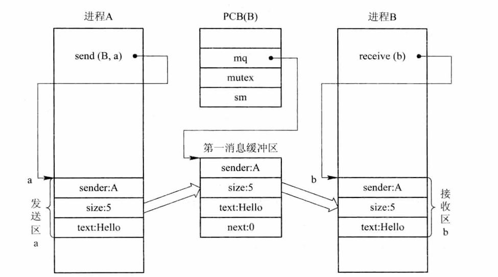

# 前趋图和程序执行
## 1. 前趋图

1. **概念**：是指一个有向**无循环**图，可记作DAG（Directed Acyclic Graph），它是用于描述进程之间执行的先后顺序。
2. 图（a）是一个正常的前趋图关系，但图（b）中$S_2$和$S_3$存在循环，这种关系使不可能是实现的


## 2. 程序的顺序执行

1. 程序的顺序执行：
	- 一个应用程序由若干个程序段组成，每一个程序段完成特定的功能，它们在执行时，都需要按照某种先后次序顺序执行，仅当前一程序段执行完后，才运行后一程序段。
	- **例如**，在进行计算时，应先运行输入程序，用于输入用户的程序和数据;然后运行计算程序，对所输入的数据进行计算;最后才是运行打印程序，打印计算结果。
2. **特征**：
	- 顺序性
	- 封闭性：程序在封闭环境下运行，独占全机，资源状态只有本程序才能改变它，除初始状态
	- 可再现性：环境和初始条件相同，无论过程如何，能复现
## 3. 程序并发执行

1. 程序的并发执行:
	- 只有在**不存在前趋关系**的程序之间才有可能并发执行
2. **特征**：
	- 间断性
	- 失去封闭性：执行并行程序时，资源则共享，环境必然受到其他程序的影响，例如处理机已被分配到某个进程运行时，其它程序必须等待
	- 不可再现性

---

# 进程的描述
# 进程控制
# 进程描述

## 管程机制

管程是一种高级同步机制，将共享资源及其操作封装在一个对象内，通过条件变量实现同步。
### 管程的组成

 1. **共享数据结构**（如缓冲池）
 2. **初始化代码**
 3. **一组操作过程**（如 put 和 get）


---
# 经典进程的同步问题

本小节主要介绍了操作系统中三个经典的进程同步问题：**生产者-消费者问题**、**哲学家进餐问题**、**读者-写者问题**的应用。
## 1. 生产者-消费者问题

该问题描述了一组生产者向缓冲区写入数据，一组消费者从缓冲区读取数据的同步逻辑。
### 核心同步逻辑

 * **互斥关系**：各进程对缓冲区（临界资源）的访问必须是互斥的。
 * **同步关系**：
	 缓冲区满时，生产者必须等待（需等待 empty > 0）。
	 缓冲区空时，消费者必须等待（需等待 full > 0）。
### 记录型信号量实现

 * mutex = 1：控制对缓冲区的互斥访问。
 * empty = n：代表空闲缓冲区的数量。
 * full = 0：代表已充满数据的缓冲区数量。

```python
# 核心操作顺序 (生产者为例)
wait(empty)  # 检查是否有空间
wait(mutex)  # 进入临界区
# ... put item ...
signal(mutex)# 退出临界区
signal(full) # 增加已满空间计数
```
## 2. 哲学家进餐问题

五个哲学家共用五只筷子，只有同时拿到左右两只筷子才能进餐。该问题的核心是**预防死锁**。
### 记录型信号量实现

 * chopstick[5] = {1, 1, 1, 1, 1}：每只筷子是一个信号量。
### 防止死锁的策略

 1. **限制人数**：至多允许四位哲学家同时去拿左边的筷子。
 2. **原子操作 (AND 信号量)**：要求同时获得左右两只筷子才允许进餐。
 3. **奇偶规则**：奇数号哲学家先拿左边再拿右边，偶数号相反。
## 3. 读者-写者问题

允许多个读者同时读，但只允许一个写者写，且写操作与其他任何操作（读/写）都互斥。
### 核心约束

 * **读-读**：不互斥，可并发。
 * **读-写**：互斥。
 * **写-写**：互斥。
### 信号量集机制 (改进版)

引入限制：最多只允许 RN 个读者同时读。
 * L = RN：控制读者数量，执行 wait(L, 1, 1)。
 * mx = 1：控制写者进入。
 * **开关作用**：Swait(mx, 1, 0) 表示只要无写者进入，读者即可进入。

## 💡 关键概念对比表
| 问题类型        | 核心冲突      | 信号量设计关键                             |
| ----------- | --------- | ----------------------------------- |
| **生产者-消费者** | 缓冲区溢出或空取  | 区分资源信号量 (empty/full) 与互斥信号量 (mutex) |
| **哲学家进餐**   | 环路等待导致死锁  | 筷子信号量的获取顺序或 AND 信号量                 |
| **读者-写者**   | 写者的唯一性    | 读计数器 (readcount) 或信号量集控制            |


---
# 进程通信
## 进程通信的基本概念与分类

1. **低级进程通信**：进程间的互斥与同步（如信号量机制）因交换信息量少、对用户不透明（程序员需自行实现数据传送、互斥同步等）且效率低，被归类为低级通信 。

2. **高级进程通信**：由操作系统提供高级通信工具（原语），隐藏通信细节，用户可方便地高效传送大量数据 。主要分为四大类：
    - **共享存储器系统**
    - **管道通信系统**
    - **消息传递系统**
    - **客户机-服务器系统**

## 共享存储器系统 (Shared-Memory System)

进程通过共享某些数据结构或存储区进行通信 。

- **基于共享数据结构的通信**：要求诸进程公用某些数据结构（如生产者-消费者问题中的有界缓冲区）。此类方式效率较低，仅适于传递少量数据，仍属于低级通信 。
- **基于共享存储区的通信**：在内存中划出块共享存储区，进程通过读写该区交换信息 。这种方式属于**高级通信**，数据形式、位置及访问控制由进程负责而非 OS 。

## 管道 (pipe) 通信系统

管道是指用于连接一个读进程和一个写进程以实现通信的共享文件，又名 pipe 文件 。

1. **实现机制**：写进程以字符流形式将数据送入管道；读进程从管道中接收数据 。
2. **必需的协调能力**：
    - **互斥**：当一个进程执行读/写操作时，另一个进程必须等待 。
    - **同步**：当写进程把 4 KB 数据写入 pipe 后便睡眠等待，直到读进程取走数据后将其唤醒；反之，读进程若发现 pipe 为空也需睡眠等待 。
    - **确定对方存在**：只有确定对方已存在时才能进行通信 。

## 客户机-服务器系统 (Client-Server System)

在网络环境下，该机制已成为当前主流的通信机制，主要实现方法包括：

1. **套接字 (Socket)**：
    - **基于文件型**：类似于管道，通信双方通过读写特殊文件实现，受本地文件系统支持 。
    - **基于网络型**：采用非对称方式通信，发送者需提供接收者命名（如 IP 地址和端口号）。每个连接都有唯一的套接字标识符，便于区分并发服务 。

2. **远程过程调用 (RPC)**：允许运行于一台主机上的进程调用另一台主机上的进程，程序员表现为常规的过程调用，无需额外编程 。

3. **远程方法调用 (RMI)**：RPC 在面向对象编程中的称呼 。
## 消息缓冲队列通信机制



### 一、 核心数据结构与信号量

为了实现安全、可靠的通信，系统引入了两种关键的数据结构与两类信号量协同工作：

1. 核心数据结构
	- **消息缓冲区 (message_buffer)**：包含发送者标识符、消息长度、消息正文及指向下一个缓冲区的指针 `next` 。
	- **PCB 中的通信项**：在进程控制块中增加消息队列首指针 `mq`，以及互斥信号量 `mutex` 和资源信号量 `sm` 。

1. 信号量的协同作用
	- **互斥信号量 (mutex/mq)**：用于防止多个进程同时操作同一个消息队列引发冲突，确保队列访问的原子性 。
	- **资源信号量 (sm)**：作为同步机制，控制进程是否有消息可收。它判断队列是否为空，是阻塞接收的触发条件 。
	- **同步逻辑**：遵循“先发送、后接收”的逻辑顺序 。

---

### 二、 通信原语执行流程

1. 发送原语 `send(receiver, a)`
	- **申请缓冲区**：根据发送区 `a` 中的消息长度申请一个系统消息缓冲区 `i` 。
	- **内容复制**：将发送区 `a` 中的消息内容完整复制到新申请的缓冲区 `i` 中 。
	- **获取标识**：获得接收进程内部的标识符 。
	- **互斥入队**：
	    - 执行 `wait(j.mutex)`：锁定接收者的消息队列 。
	    - 执行 `insert(&j.mq, i)`：将消息缓冲区挂载到接收者的 `mq` 队列末尾 。
	    - 执行 `signal(j.mutex)`：释放互斥锁 。
	- **同步通知**：执行 `signal(j.sm)`，资源信号量加 1，通知接收进程有新消息到达 。

2. 接收原语 `receive(b)`
	- **同步等待**：执行 `wait(j.sm)`。若队列为空则进程阻塞，直到被发送进程唤醒 。
	- **互斥出队**：
	    - 执行 `wait(j.mutex)`：锁定自己的消息队列 。
	    - 执行 `remove(j.mq, i)`：按照**先进先出 (FIFO)** 原则摘下队列中的第一个消息缓冲区 `i` 。
	    - 执行 `signal(j.mutex)`：释放互斥锁 。
	- **提取消息**：将缓冲区 `i` 中的数据复制到指定的接收区 `b` 中 。
	- **释放资源**：执行 `releasebuf(i)`，归还并释放该消息缓冲区 。

---

### 三、 机制特征与优势

- **异步通信 (Asynchronous)**：发送者将消息放入队列后即可继续执行，无需等待接收者实时处理；接收者则根据自身状态自主从队列获取，实现了双方的解耦 。
- **透明性**：OS 隐藏了通信的细节（如缓冲区申请、指针挂接等），对用户而言，通信过程是透明且易用的 。
- **应用场景**：广泛应用于多处理机系统、分布式系统及微内核架构中，类似于老师布置作业与学生完成作业的时序关系 。
- **安全性**：通过 PV 操作确保了消息队列这一“临界资源”在并发环境下的数据一致性 。

> **提示**：复习时可参考教材第 61 页关于信号量实现互斥与前驱关系的内容，以加深对 `mutex` 和 `sm` 逻辑的理解 。

## 消息传递通信的实现细节
### 寻址方式

- **直接通信方式**：发送原语需显式提供接收者标识符 `send(P, message)` 。
    - **对称寻址**：要求发送和接收进程都必须提供对方标识 。
    - **非对称寻址**：接收进程可从任何进程接收消息，原语形式为 `receive(id, message)`，其中 `id` 变量设置为发送方的标识 。

- **间接通信方式**：通过共享中间实体（信箱）进行通信 。

### 2. 消息格式与同步

- **格式**：分为定长消息格式（减少存储开销，适于自动化系统）和变长消息格式（方便用户，但处理开销较大） 。

- **同步机制 (Rendezvous)**：
    - **发送、接收均阻塞**：用于进程间紧密同步 。
    - **发送不阻塞、接收阻塞**：应用最广的形式，发送进程发完即走，接收进程无消息时阻塞 。
    - **发送、接收均不阻塞**：较常见，各自忙自己的，仅当发生特定事件无法运行时才阻塞 。

# 线程的基本概念
